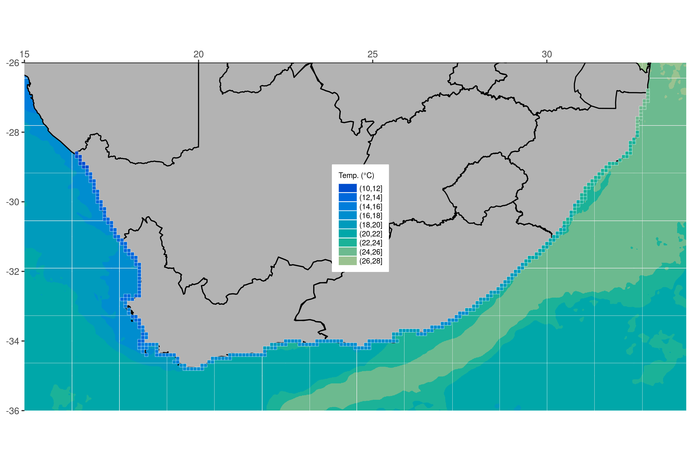

# Mapping with **`ggplot2`** {#mapping}

> "There's no map to human behaviour."
>
> --- Bjork
  
> "Here be dragons"
> 
> --- Unknown

```{r map-opts, echo=FALSE}
knitr::opts_chunk$set(
  comment = "R>", 
  warning = FALSE, 
  message = FALSE
)
```

Yesterday we learned how to create **`ggplot2`** figures, change their aesthetics, labels, colour palettes, and facet/arrange them. Now we are going to look at how to create maps. 

Most of the work that we perform as environmental/biological scientists involves going out to a location and sampling information there. Sometimes only once, and sometimes over a period of time. All of these different sampling methods lend themselves to different types of figures. One of those, collection of data at different points, is best shown with maps. As we will see over the course of Day 3, creating maps in **`ggplot2`** is very straight forward and is extensively supported. For that reason we are going to have plenty of time to also learn how to do some more advanced things. Our goal in this chapter is to produce the figure below.

```{r map-goal, echo = FALSE, fig.cap = "The goal for today.", out.width = "100%", fig.align = "center"}

```

Before we begin let's go ahead and load the packages we will need, as well as the several dataframes required to make the final product.

```{r map-load}
# Load libraries
library(tidyverse)
library(ggpubr)

# Load data
load("data/south_africa_coast.RData")
load("data/sa_provinces.RData")
load("data/rast_annual.RData")
load("data/MUR.RData")
load("data/MUR_low_res.RData")

# Choose which SST product you would like to use
sst <- MUR_low_res
# OR
sst <- MUR

# The colour pallette we will use for ocean temperature
cols11 <- c("#004dcd", "#0068db", "#007ddb", "#008dcf", "#009bbc",
            "#00a7a9", "#1bb298", "#6cba8f", "#9ac290", "#bec99a")
```

## A new concept?

The idea of creating a map in R may be daunting to some, but remember that a basic map is nothing more than a simple figure with an x and y axis. We tend to think of maps as different from other scientific figures, whereas in reality they are created the exact same way. Let's compare a dot plot of the chicken weight data against a dot plot of the coastline of South Africa.

Chicken dots:

```{r map-point-1, fig.cap="Dot plot of chicken weight data."}
ggplot(data = ChickWeight, aes(x = Time, y = weight)) +
  geom_point()
```

South African coast dots:

```{r map-point-2, fig.cap="Dot plot off South African coast."}
ggplot(data = south_africa_coast, aes(x = lon, y = lat)) +
  geom_point()
```

Does that look familiar? Notice how the x and y axis tick labels look the same as any map you would see in an atlas. This is because they are. But this isn't a great way to create a map. Rather it is better to represent the land mass with a polygon. With **`ggplot2`** this is a simple task.

## Land mask

Now that we have seen that a map is nothing more than a bunch of dots and shapes on specific points along the x and y axes we are going to look at the steps we would take to build a more complex map. Don't worry if this seems daunting at first. We are going to take this step by step and ensure that each step is made clear along the way. The first step is to create a polygon. Note that we create an aesthetic argument inside of `geom_polygon()` and not `ggplot()` because some of the steps we will take later on will not accept the `group` aesthetic. Remember, whatever aesthetic arguments we put inside of `ggplot()` will be inserted for us into all of our other `geom_...()` lines of code.

```{r map-polygon, fig.cap="The map of South Africa. Now with province borders!"}
ggplot(data = south_africa_coast, aes(x = lon, y = lat)) +
  geom_polygon(colour = "black", fill = "grey70", aes(group = group)) # The land mask
```

## Borders

The first thing we will add is the province borders as seen in Figure \@ref(fig:map-goal). Notice how we only add one more line of code to do this.

```{r map-province, fig.cap="The map of South Africa. Now with province borders!"}
ggplot(data = south_africa_coast, aes(x = lon, y = lat)) +
  geom_polygon(colour = "black", fill = "grey70", aes(group = group)) +
  geom_path(data = sa_provinces, aes(group = group)) # The province borders
```

## Force lon/lat extent

Unfortunately when we added our borders it increased the plotting area of our map past what we would like. To correct that we will need to explicitly state the borders we want.

```{r map-expand, fig.cap="The map, but with the extra bits snipped off."}
ggplot(data = south_africa_coast, aes(x = lon, y = lat)) +
  geom_polygon(colour = "black", fill = "grey70", aes(group = group)) +
  geom_path(data = sa_provinces, aes(group = group)) + 
  coord_equal(xlim = c(15, 34), ylim = c(-36, -26), expand = 0) # Force lon/lat extent
```

## Ocean temperature

This is starting to look pretty fancy, but it would be nicer if there was some colour involved. So let's add the ocean temperature. Again, this will only require one more line of code. Starting to see a pattern? But what is different this time and why?

```{r map-MUR, fig.cap="Ocean temperature (°C) visualised as an ice cream spill."}
ggplot(data = south_africa_coast, aes(x = lon, y = lat)) +
  geom_raster(data = sst, aes(fill = bins)) + # The ocean temperatures
  geom_polygon(colour = "black", fill = "grey70", aes(group = group)) +
  geom_path(data = sa_provinces, aes(group = group)) +
  coord_equal(xlim = c(15, 34), ylim = c(-36, -26), expand = 0)
```

That looks... odd. Why do the colours look like someone melted a big bucket of ice cream in the ocean? This is because the colours you see in this figure are the default colours for discrete values in **`ggplot2`**. If we want to change them we may do so easily by adding yet one more line of code.

```{r map-colour, fig.cap="Ocean temperatures (°C) around South Africa."}
ggplot(data = south_africa_coast, aes(x = lon, y = lat)) +
  geom_raster(data = sst, aes(fill = bins)) +
  geom_polygon(colour = "black", fill = "grey70", aes(group = group)) +
  geom_path(data = sa_provinces, aes(group = group)) +
  scale_fill_manual("Temp. (°C)", values = cols11) + # Set the colour palette
  coord_equal(xlim = c(15, 34), ylim = c(-36, -26), expand = 0)
```

There's a colour palette that would make Jacques Cousteau swoon. When we set the colour palette for a figure in **`ggplot2`** we must use that colour palette for all other instances of those types of values, too. What this means is that any other discrete values that will be filled in, like the ocean colour above, must use the same colour palette (there are some technical exceptions to this rule that we will not cover in this course). We normally want **`ggplot2`** to use consistent colour palettes anyway, but it is important to note that this constraint exists. Let's see what we mean. Next we will add the coastal pixels to our figure with one more line of code. We won't change anything else. Note how **`ggplot2`** changes the colour of the coastal pixels to match the ocean colour automatically.

```{r map-raster, fig.cap="Map of SOuth Africa showing *in situ* temeperatures (°C) as pixels along the coast."}
ggplot(data = south_africa_coast, aes(x = lon, y = lat)) +
  geom_raster(data = sst, aes(fill = bins)) +
  geom_polygon(colour = "black", fill = "grey70", aes(group = group)) +
  geom_path(data = sa_provinces, aes(group = group)) +
  geom_tile(data = rast_annual, aes(x = lon, y = lat, fill = bins), 
            colour = "white", size = 0.1) + # The coastal temperature values
  scale_fill_manual("Temp. (°C)", values = cols11) +
  coord_equal(xlim = c(15, 34), ylim = c(-36, -26), expand = 0)
```

## Final touches

We used `geom_tile()` instead of `geom_rast()` to add the coastal pixels above so that we could add those little white boxes around them. This figure is looking pretty great now. And it only took a few rows of code to put it all together! The last step is to add several more lines of code that will control for all of the little things we want to change about the appearance of the figure. Each little thing that is changed below is annotated for your convenience.

```{r map-final, fig.cap="The cleaned up map of South Africa. Resplendent with coastal and ocean temperatures (°C)."}
final_map <- ggplot(data = south_africa_coast, aes(x = lon, y = lat)) +
  geom_raster(data = sst, aes(fill = bins)) +
  geom_polygon(colour = "black", fill = "grey70", aes(group = group)) +
  geom_path(data = sa_provinces, aes(group = group)) +
  geom_tile(data = rast_annual, aes(x = lon, y = lat, fill = bins), 
            colour = "white", size = 0.1) +
  scale_fill_manual("Temp. (°C)", values = cols11) +
  coord_equal(xlim = c(15, 34), ylim = c(-36, -26), expand = 0) +
  scale_x_continuous(position = "top") + # Put x axis labels on top of figure
  theme(axis.title = element_blank(), # Remove the axis labels
        legend.text = element_text(size = 7), # Change text size in legend
        legend.title = element_text(size = 7), # Change legend title text size
        legend.key.height = unit(0.3, "cm"), # Change size of legend
        legend.background = element_rect(colour = "white"), # Add legend background
        legend.justification = c(1, 0), # Change position of legend
        legend.position = c(0.55, 0.4) # Fine tune position of legend
        )
final_map
```

That is a very clean looking map so let's go ahead and save it on our computers

```{r map-save, eval=FALSE}
ggsave(plot = final_map, "figures/map_complete.pdf", height = 6, width = 9)
```

## Session info
```{r, echo=TRUE, include=TRUE}
installed.packages()[names(sessionInfo()$otherPkgs), "Version"]
```
